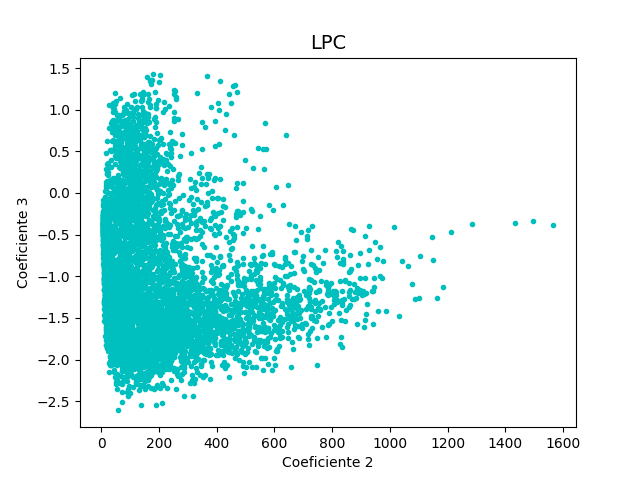
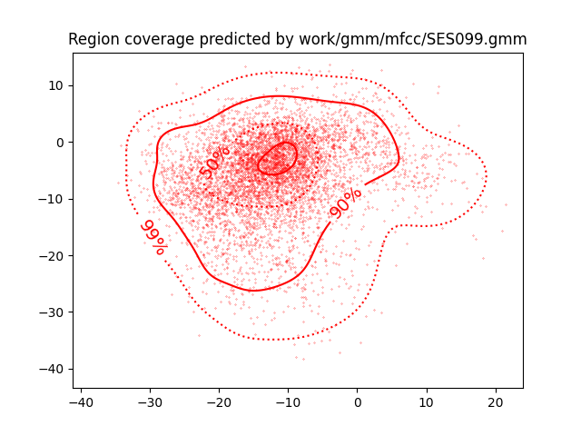

PAV - P4: reconocimiento y verificación del locutor
===================================================

Obtenga su copia del repositorio de la práctica accediendo a [Práctica 4](https://github.com/albino-pav/P4)
y pulsando sobre el botón `Fork` situado en la esquina superior derecha. A continuación, siga las
instrucciones de la [Práctica 2](https://github.com/albino-pav/P2) para crear una rama con el apellido de
los integrantes del grupo de prácticas, dar de alta al resto de integrantes como colaboradores del proyecto
y crear la copias locales del repositorio.

También debe descomprimir, en el directorio `PAV/P4`, el fichero [db_8mu.tgz](https://atenea.upc.edu/pluginfile.php/3145524/mod_assign/introattachment/0/spk_8mu.tgz?forcedownload=1)
con la base de datos oral que se utilizará en la parte experimental de la práctica.

Como entrega deberá realizar un *pull request* con el contenido de su copia del repositorio. Recuerde
que los ficheros entregados deberán estar en condiciones de ser ejecutados con sólo ejecutar:

~~~~~~~~~~~~~~~~~~~~~~~~~~~~~~~~~~~~~~~~~~~~~~~~~~~~~.sh
  make release
  run_spkid mfcc train test classerr verify verifyerr
~~~~~~~~~~~~~~~~~~~~~~~~~~~~~~~~~~~~~~~~~~~~~~~~~~~~~

Recuerde que, además de los trabajos indicados en esta parte básica, también deberá realizar un proyecto
de ampliación, del cual deberá subir una memoria explicativa a Atenea y los ficheros correspondientes al
repositorio de la práctica.

A modo de memoria de la parte básica, complete, en este mismo documento y usando el formato *markdown*, los
ejercicios indicados.

## Ejercicios.

### SPTK, Sox y los scripts de extracción de características.

- Analice el script `wav2lp.sh` y explique la misión de los distintos comandos involucrados en el *pipeline*
  principal (`sox`, `$X2X`, `$FRAME`, `$WINDOW` y `$LPC`). Explique el significado de cada una de las 
  opciones empleadas y de sus valores.

  >El comando para la extracción de características es el siguiente:
  >```zsh
  > sox $inputfile -t raw -e signed -b 16 - | $X2X +sf | $FRAME -l 240 -p 80 |
  >   $WINDOW -l 240 -L 240 | $LPC -l 240 -m $lpc_order > $base.lp
  >```
  >La función de los distintos comandos es:

   > * `sox`: Se usa para cambiar el formato de un archivo de audio, así como su codificación, frec_muestreo etc. Tiene los siguientes parámetros `-t`, `-e` y `-b`.
  >
  >   - `-t`: Indica el formato del fichero. En nuestro caso es raw.
  >   - `-e`: Indica el tipo de codificación que se le aplica al fichero de entrada. En este caso, signed-integer.
  >   - `-b`: Indica el número de bits por muestra que se utilizan en la codificación. En nuestro caso 16 bits
  >
   > - `$X2X`: Convierte el tipo de los datos. En nuestro caso, como queremos converir de short (2 Bytes) a float (4 Bytes), usamos la siguiente línea de código:

  >  ```zsh
   > $X2X +sf
  >  ```
  
  > - `$FRAME`: Su función es la de dividir la secuencia de datos de un archivo en tramas distintas. En nuestro queremos una duración de 240 muestras con periodo de 80, por lo usamos la siguiente línea de código:
  >```zsh
   > $FRAME -l 240 -p 80
  >  ```
  >
  > - `$WINDOW`: Se encarga de enventanar una trama de datos. Nuestra ventana es de 240 muestras y  >  dejamos el valor por defecto de la ventana a usar, por lo que por defecto tenemos la ventana >Blackman. La línea de código que usamos es la siguiente
   ```zsh
    $WINDOW -l 240 -L 240 |
    ```
  >
  > - `$LPC`: calcula los coeficientes LPC de orden m de las l muestras del señal de entrada.En >nuestro caso usamos 240 muestras y el orden a escoger. Después guardamos los coeficientes en >`base_lp`

   ```zsh
    $LPC -l 240 -m $lpc_order > $base.lp
    ```

- Explique el procedimiento seguido para obtener un fichero de formato *fmatrix* a partir de los ficheros de
  salida de SPTK (líneas 45 a 47 del script `wav2lp.sh`).

>```zsh
>ncol=$((lpc_order+1)) # lpc p =>  (gain a1 a2 ... ap) 
>nrow=`$X2X +fa < $base.lp | wc -l | perl -ne 'print $_/'$ncol', "\n";'`
>```

 >El procediento es el siguiente:

 >Primeramente, covertimos los datos obtenidos de **float** a **ASCII**.
 >Después, mediante el número de lineas del archivo de texto, con el comando wc -l determinamos el >valor de nrow.


  * ¿Por qué es conveniente usar este formato (u otro parecido)? Tenga en cuenta cuál es el formato de
    entrada y cuál es el de resultado.
> Porque permite una visualización más clara los coeficientes que corresponden a cada fila gracias a >la función fmatrix. 

- Escriba el *pipeline* principal usado para calcular los coeficientes cepstrales de predicción lineal
  (LPCC) en su fichero <code>scripts/wav2lpcc.sh</code>:

>```zsh
> sox $inputfile -t raw -e signed -b 16 - | $X2X +sf | $FRAME -l 240 -p 80 | $WINDOW -l 240 -L 240 |
	$LPC -l 240 -m $lpc_order | $LPC2C -m $lpc_order -M $cepstrum_order > $base.lpcc
>```
>Observamos que el comando es prácticamente idéntico al `wav2lp.sh` pero se ha añadido la función >`$LPC2C` para converitr los coeficientes LPC a LPCC, con las opciones `m` para el orden de los coeficientes LPC de entrada y `M` para el orden de los coeficientes LPCC de salida

- Escriba el *pipeline* principal usado para calcular los coeficientes cepstrales en escala Mel (MFCC) en su
  fichero <code>scripts/wav2mfcc.sh</code>:

```zsh
  sox $inputfile -t raw -e signed -b 16 - | $X2X +sf | $FRAME -l 240 -p 80 | $WINDOW -l 240 -L 240 |
	$MFCC -l 240 -m $mfcc_order -w 1 -n 26 -s 8 > $base.mfcc
  ```


>Observamos que el comando es prácticamente idéntico al `wav2lp.sh` pero se ha añadido la función >`$MFCC` calcular los coeficientes MFFC, con las opciones `s` para la frec_muestreo, `-l` para la >longitud de la trama,`m` para el orden de los coeficientes MFCC y `-n`, para la cantidad de filtros >MEL usados


### Extracción de características.

- Inserte una imagen mostrando la dependencia entre los coeficientes 2 y 3 de las tres parametrizaciones
  para todas las señales de un locutor.

  + Indique **todas** las órdenes necesarias para obtener las gráficas a partir de las señales 
    parametrizadas.

    >Primeramente, generamos los archivos de texto con los coeficientes a través del siguiente comando
>
```zsh
  >  fmatrix_show work/lp/BLOCK09/SES099/*.lp | egrep '^\[' | cut -f2,3 > lp_2_3.txt
  >  fmatrix_show work/lpcc/BLOCK09/SES099/*.lpcc | egrep '^\[' | cut -f2,3 > lpcc_2_3.txt
  >  fmatrix_show work/mfcc/BLOCK09/SES099/*.mfcc | egrep '^\[' | cut -f2,3 > mfcc_2_3.txt
 ```
>Despúes, a través del código implementado en archivo comparacion_coef en el directorio >python_scripts, obtenemos las siguientes gráficas

> 
  >
  > 
  >
  > 


  + ¿Cuál de ellas le parece que contiene más información?

  >Podemos observar que los coeficientes MFCC no están tan correlados como los LPCC ni mucho menos como los LPC, por lo que en orden de aportación de información, primero tenemos los MFCC, después los LPCC y finalmente los LPC

- Usando el programa <code>pearson</code>, obtenga los coeficientes de correlación normalizada entre los
  parámetros 2 y 3 para un locutor, y rellene la tabla siguiente con los valores obtenidos.

  |                        |    LP     |   LPCC   |   MFCC    |
  |------------------------|:---------:|:--------:|:---------:|
  | &rho;<sub>x</sub>[2,3] | -0.781375 | 0.117271 | -0.166605 |
  
  + Compare los resultados de <code>pearson</code> con los obtenidos gráficamente.
  
- Según la teoría, ¿qué parámetros considera adecuados para el cálculo de los coeficientes LPCC y MFCC?

>Como hemos aprendido en clase, para una correcta parametrización MFCC necesitamos alrededor de unos 30 y entre 24-40 filtros MEL. Para la parametrización LPCC, alrededor de 12 coeficientes y para la LPC unos 8.


### Entrenamiento y visualización de los GMM.

Complete el código necesario para entrenar modelos GMM.

- Inserte una gráfica que muestre la función de densidad de probabilidad modelada por el GMM de un locutor
  para sus dos primeros coeficientes de MFCC.
  
>Lo hacemos con el siguiente comando en el terminal:
>```zsh
>  plot_gmm_feat -x1 -y2 -p 99,90,50,10 work/gmm/mfcc/SES099.gmm work/mfcc/BLOCK09/SES099/SA099S*
```


- Inserte una gráfica que permita comparar los modelos y poblaciones de dos locutores distintos (la gŕafica
  de la página 20 del enunciado puede servirle de referencia del resultado deseado). Analice la capacidad
  del modelado GMM para diferenciar las señales de uno y otro.

>Usamos el siguiente comando:

>```zsh
>   plot_gmm_feat -x1 -y2 -p 99,90,50,10 -g seagreen -f darkorchid work/gmm/mfcc/SES008.gmm work/mfcc/BLOCK09/SES099/SA099S*
```


### Reconocimiento del locutor.

Complete el código necesario para realizar reconociminto del locutor y optimice sus parámetros.

- Inserte una tabla con la tasa de error obtenida en el reconocimiento de los locutores de la base de datos
  SPEECON usando su mejor sistema de reconocimiento para los parámetros LP, LPCC y MFCC.

>Capturas de los errores:

  ># LP  
   > 
  ># LPCC
     > 
  ># MFCC
    > 

  >  |                 |       LP      |     LPCC     |     MFCC    |
  >  |-----------------|:-------------:|:------------:|:-----------:|
  >  | Tasa de errores |      12.23%    |     0.76%    |    1.15%    |


### Verificación del locutor.

Complete el código necesario para realizar verificación del locutor y optimice sus parámetros.

- Inserte una tabla con el *score* obtenido con su mejor sistema de verificación del locutor en la tarea
  de verificación de SPEECON. La tabla debe incluir el umbral óptimo, el número de falsas alarmas y de
  pérdidas, y el score obtenido usando la parametrización que mejor resultado le hubiera dado en la tarea
  de reconocimiento.
 
>Capturas de la verificación:

  ># LP  
   > 
  ># LPCC
     > 
  ># MFCC
    > 

  |                         | LP                   | LPCC                  | MFCC                |
  |------------------------ |:--------------------:|:---------------------:|:-------------------:|
  | THR;                    |  1.20227688589881    |   0.405596651130504   |   0.480412356315202 |
  | Missed;                 |   226/250=0.9040     |   46/250=0.1840       |   40/250=0.1600     |
  | False Alarm;            |   0/1000=0.0000      |   0/1000=0.0000       |   0/1000=0.0000     |
  | Cost Detection;         |   90.4               |   18.4                |   16.0              |


### Test final

- Adjunte, en el repositorio de la práctica, los ficheros `class_test.log` y `verif_test.log` 
  correspondientes a la evaluación *ciega* final.

### Trabajo de ampliación.

- Recuerde enviar a Atenea un fichero en formato zip o tgz con la memoria (en formato PDF) con el trabajo 
  realizado como ampliación, así como los ficheros `class_ampl.log` y/o `verif_ampl.log`, obtenidos como 
  resultado del mismo.
